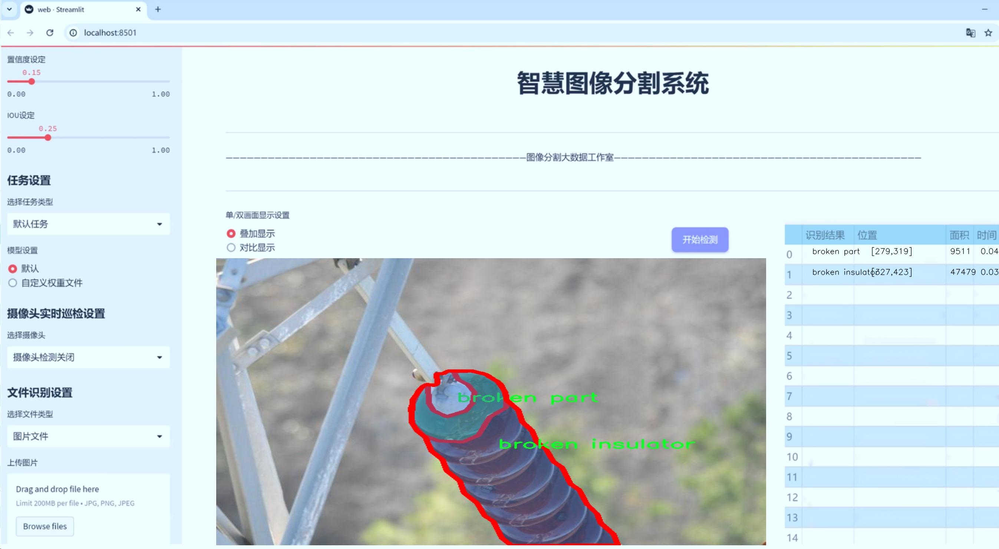
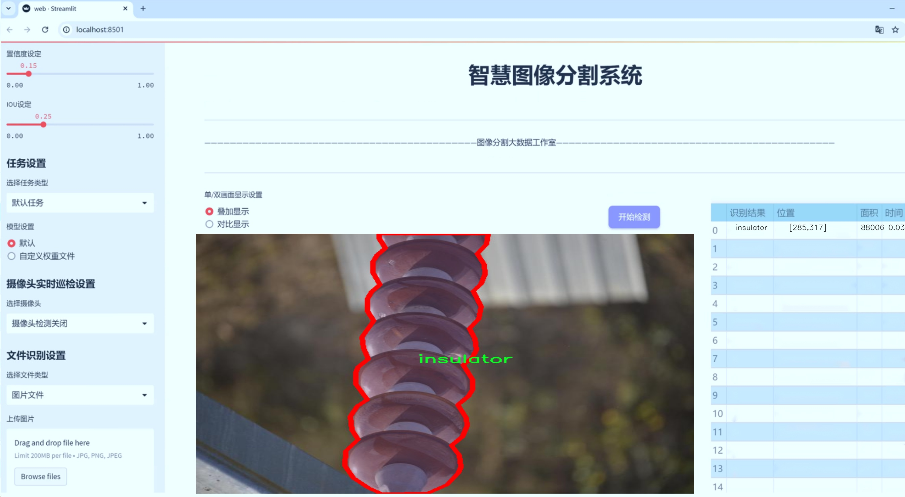
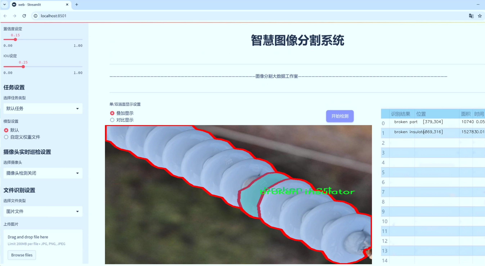
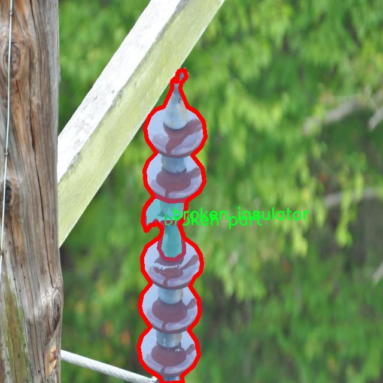
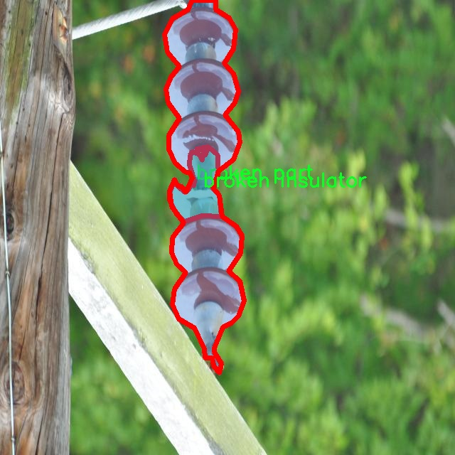
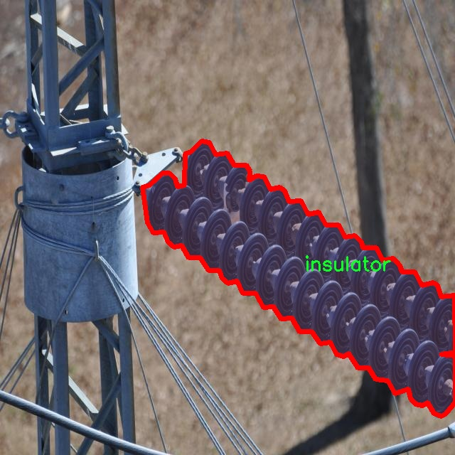
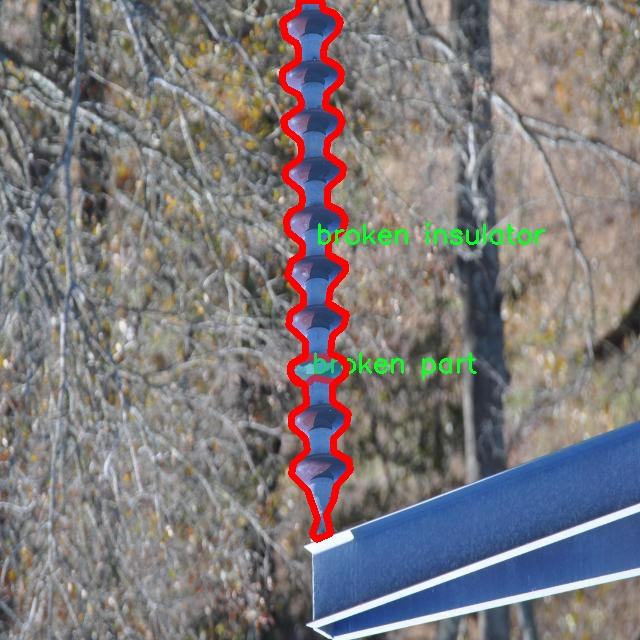
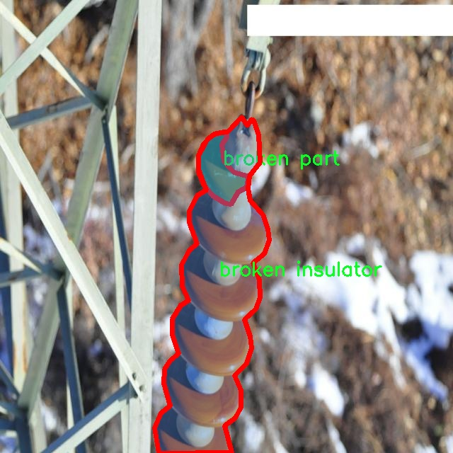

# 电力设备缺陷分割系统源码＆数据集分享
 [yolov8-seg-C2f-DCNV3＆yolov8-seg-act等50+全套改进创新点发刊_一键训练教程_Web前端展示]

### 1.研究背景与意义

项目参考[ILSVRC ImageNet Large Scale Visual Recognition Challenge](https://gitee.com/YOLOv8_YOLOv11_Segmentation_Studio/projects)

项目来源[AAAI Global Al lnnovation Contest](https://kdocs.cn/l/cszuIiCKVNis)

研究背景与意义

随着电力行业的快速发展，电力设备的安全性和可靠性愈发受到重视。电力设备在长期运行过程中，常常会出现各种缺陷，如绝缘子破损、设备部件损坏等，这些缺陷不仅影响设备的正常运行，还可能导致电力系统的故障，甚至引发安全事故。因此，及时、准确地检测和分割电力设备的缺陷，对于保障电力系统的安全稳定运行具有重要意义。

近年来，计算机视觉技术的迅猛发展为电力设备缺陷检测提供了新的解决方案。尤其是基于深度学习的目标检测与分割算法，凭借其高效的特征提取能力和强大的分类性能，逐渐成为电力设备缺陷检测的主流方法。其中，YOLO（You Only Look Once）系列算法因其实时性和高精度而备受关注。YOLOv8作为该系列的最新版本，进一步提升了检测精度和速度，成为电力设备缺陷分割的理想选择。然而，现有的YOLOv8模型在处理电力设备缺陷时，仍然面临着一些挑战，如对小目标的检测能力不足、对复杂背景的适应性差等。因此，改进YOLOv8以适应电力设备缺陷分割的需求，具有重要的研究价值。

本研究基于改进YOLOv8的电力设备缺陷分割系统，利用一个包含1600张图像的专用数据集进行训练和测试。该数据集涵盖了四类缺陷：破损绝缘子、破损部件、缺陷和绝缘子。这些类别的划分不仅有助于细化缺陷检测的标准，还为后续的缺陷分析和维修提供了重要依据。通过对这些图像的深度学习训练，模型能够学习到不同缺陷的特征，从而实现高效的缺陷分割和分类。

在研究过程中，我们将针对YOLOv8模型的结构进行优化，采用数据增强、特征融合等技术，提升模型在电力设备缺陷检测中的表现。同时，结合实例分割技术，我们将实现对缺陷区域的精确定位，为电力设备的维护和管理提供数据支持。通过构建这一电力设备缺陷分割系统，不仅能够提高缺陷检测的效率和准确性，还能够为电力行业的智能化发展提供有力的技术支撑。

总之，基于改进YOLOv8的电力设备缺陷分割系统的研究，不仅填补了电力设备缺陷检测领域的技术空白，也为实现电力设备的智能监测和维护提供了新的思路和方法。随着研究的深入，预计将为电力行业的安全管理、故障预警和设备维护提供更加科学、有效的解决方案，推动电力行业的可持续发展。

### 2.图片演示







##### 注意：由于此博客编辑较早，上面“2.图片演示”和“3.视频演示”展示的系统图片或者视频可能为老版本，新版本在老版本的基础上升级如下：（实际效果以升级的新版本为准）

  （1）适配了YOLOV8的“目标检测”模型和“实例分割”模型，通过加载相应的权重（.pt）文件即可自适应加载模型。

  （2）支持“图片识别”、“视频识别”、“摄像头实时识别”三种识别模式。

  （3）支持“图片识别”、“视频识别”、“摄像头实时识别”三种识别结果保存导出，解决手动导出（容易卡顿出现爆内存）存在的问题，识别完自动保存结果并导出到tempDir中。

  （4）支持Web前端系统中的标题、背景图等自定义修改，后面提供修改教程。

  另外本项目提供训练的数据集和训练教程,暂不提供权重文件（best.pt）,需要您按照教程进行训练后实现图片演示和Web前端界面演示的效果。

### 3.视频演示

[3.1 视频演示](https://www.bilibili.com/video/BV1JYytYcEhH/)

### 4.数据集信息展示

##### 4.1 本项目数据集详细数据（类别数＆类别名）

nc: 4
names: ['broken insulator', 'broken part', 'defect', 'insulator']


##### 4.2 本项目数据集信息介绍

数据集信息展示

在电力设备的维护与管理中，及时识别和处理设备缺陷至关重要。为此，本研究采用了名为“15_03_2024”的数据集，旨在训练和改进YOLOv8-seg模型，以实现电力设备缺陷的高效分割和识别。该数据集专注于电力设备的多种缺陷，包含四个主要类别，分别为“broken insulator”（破损绝缘子）、“broken part”（破损部件）、“defect”（缺陷）和“insulator”（绝缘子）。这些类别涵盖了电力设备在实际运行中可能出现的主要问题，具有重要的实用价值。

数据集“15_03_2024”由多种电力设备的图像组成，这些图像经过精心标注，以确保模型在训练过程中能够准确学习到各类缺陷的特征。每个类别的图像均代表了不同的电力设备状态，涵盖了从轻微损伤到严重破损的多种情况。这种多样性不仅提高了模型的鲁棒性，也使其在实际应用中能够更好地适应不同的场景和条件。

在具体的类别划分中，“broken insulator”代表了电力设备中绝缘子出现的破损情况，通常会导致电力传输效率降低，甚至引发安全隐患。“broken part”则涵盖了设备中其他部件的损坏，如连接器、开关等，这些部件的完整性直接关系到设备的正常运行。“defect”类别则是一个更为广泛的概念，涵盖了所有未被明确分类的缺陷情况，可能包括表面裂纹、腐蚀等多种问题。而“insulator”类别则主要用于标识正常状态下的绝缘子，以便模型能够在训练中学习到正常与异常之间的差异。

为了确保数据集的有效性和可靠性，所有图像均经过专业人员的审核和标注，确保每个缺陷的特征都能够被准确捕捉。数据集的构建过程还考虑到了不同光照、角度和背景对图像质量的影响，力求在多种环境下都能提供高质量的训练数据。这种细致入微的准备工作为后续模型的训练打下了坚实的基础。

在模型训练过程中，数据集“15_03_2024”将作为YOLOv8-seg模型的主要输入，帮助模型学习到电力设备缺陷的关键特征。通过对不同类别的样本进行训练，模型将能够在实际应用中实现对电力设备缺陷的自动检测与分割，从而提高设备维护的效率，降低人工检查的成本和风险。

综上所述，数据集“15_03_2024”不仅在数量和质量上满足了电力设备缺陷检测的需求，更通过精确的类别划分和丰富的样本特征，为YOLOv8-seg模型的训练提供了强有力的支持。这一数据集的成功应用，将为电力设备的智能化管理和维护提供新的思路和方法，推动电力行业的技术进步与发展。











### 5.全套项目环境部署视频教程（零基础手把手教学）

[5.1 环境部署教程链接（零基础手把手教学）](https://www.bilibili.com/video/BV1jG4Ve4E9t/?vd_source=bc9aec86d164b67a7004b996143742dc)


[5.2 安装Python虚拟环境创建和依赖库安装视频教程链接（零基础手把手教学）](https://www.bilibili.com/video/BV1nA4VeYEze/?vd_source=bc9aec86d164b67a7004b996143742dc)

### 6.手把手YOLOV8-seg训练视频教程（零基础小白有手就能学会）

[6.1 手把手YOLOV8-seg训练视频教程（零基础小白有手就能学会）](https://www.bilibili.com/video/BV1cA4VeYETe/?vd_source=bc9aec86d164b67a7004b996143742dc)


按照上面的训练视频教程链接加载项目提供的数据集，运行train.py即可开始训练



     Epoch   gpu_mem       box       obj       cls    labels  img_size
     1/200     0G   0.01576   0.01955  0.007536        22      1280: 100%|██████████| 849/849 [14:42<00:00,  1.04s/it]
               Class     Images     Labels          P          R     mAP@.5 mAP@.5:.95: 100%|██████████| 213/213 [01:14<00:00,  2.87it/s]
                 all       3395      17314      0.994      0.957      0.0957      0.0843

     Epoch   gpu_mem       box       obj       cls    labels  img_size
     2/200     0G   0.01578   0.01923  0.007006        22      1280: 100%|██████████| 849/849 [14:44<00:00,  1.04s/it]
               Class     Images     Labels          P          R     mAP@.5 mAP@.5:.95: 100%|██████████| 213/213 [01:12<00:00,  2.95it/s]
                 all       3395      17314      0.996      0.956      0.0957      0.0845

     Epoch   gpu_mem       box       obj       cls    labels  img_size
     3/200     0G   0.01561    0.0191  0.006895        27      1280: 100%|██████████| 849/849 [10:56<00:00,  1.29it/s]
               Class     Images     Labels          P          R     mAP@.5 mAP@.5:.95: 100%|███████   | 187/213 [00:52<00:00,  4.04it/s]
                 all       3395      17314      0.996      0.957      0.0957      0.0845


### 7.50+种全套YOLOV8-seg创新点代码加载调参视频教程（一键加载写好的改进模型的配置文件）

[7.1 50+种全套YOLOV8-seg创新点代码加载调参视频教程（一键加载写好的改进模型的配置文件）](https://www.bilibili.com/video/BV1Hw4VePEXv/?vd_source=bc9aec86d164b67a7004b996143742dc)

### 8.YOLOV8-seg图像分割算法原理

原始YOLOv8-seg算法原理

YOLOv8-seg算法是YOLO系列目标检测算法中的一个重要进展，结合了目标检测与语义分割的特性，旨在实现更高效、更精确的图像理解。作为2023年由Ultralytics公司推出的YOLOv8的延续，YOLOv8-seg在YOLOv8的基础上进行了进一步的优化，尤其是在处理复杂场景和小目标方面，展现出更强的能力。

YOLOv8-seg的核心原理依然基于YOLO系列的anchor-free设计理念，这一理念的引入使得YOLOv8-seg在目标检测时不再依赖于预定义的锚框，从而提高了检测精度和速度。YOLOv8-seg通过将整个图像作为输入，利用深度卷积神经网络直接进行目标检测和定位，避免了传统方法中滑动窗口和区域提议的复杂计算过程。这种设计不仅提升了算法的运行效率，还增强了其在多样化场景下的适应能力。

在网络结构方面，YOLOv8-seg采用了更深的卷积神经网络，结合了特征金字塔网络（FPN）和路径聚合网络（PAN）结构。这种结构的设计允许算法在不同尺度上有效地融合特征，从而提升对小目标的检测能力。YOLOv8-seg的主干网络由多个C2f模块构成，这些模块通过引入更多的分支来丰富梯度回传过程中的信息流动，使得特征提取更加细致。与YOLOv5的C3模块相比，C2f模块的设计更加灵活，能够更好地捕捉图像中的细节信息。

在数据预处理阶段，YOLOv8-seg依然采用了YOLOv5的增强策略，包括马赛克增强、混合增强、空间扰动和颜色扰动等。这些增强手段不仅丰富了训练数据集，还提高了模型的泛化能力，使其在实际应用中表现得更加稳健。此外，YOLOv8-seg在训练过程中引入了多尺度训练和测试策略，进一步提升了模型对不同场景的适应性。

YOLOv8-seg的检测头采用了解耦结构，这一结构将分类和回归任务分开处理，使得模型在进行目标分类和定位时能够更加专注。具体而言，YOLOv8-seg通过两条并行的分支分别提取类别特征和位置特征，最后通过1×1卷积层完成分类和定位的任务。这种解耦设计不仅提高了模型的效率，还降低了计算复杂度。

在标签分配策略上，YOLOv8-seg采用了动态标签分配方法，解决了传统YOLO系列中正负样本匹配不均衡的问题。通过引入TOOD策略，YOLOv8-seg能够在训练过程中更有效地分配标签，确保每个样本的损失计算都能准确反映其在模型训练中的重要性。这一策略的实施，使得YOLOv8-seg在处理复杂背景和小目标时，能够显著降低误检和漏检的概率。

在损失函数的设计上，YOLOv8-seg引入了Varifocal Loss（VFL）和CIoU Loss等新型损失函数。这些损失函数通过对正负样本进行加权处理，使得模型在训练时能够更加关注高质量的正样本，从而提升整体的检测精度。VFL通过不对称参数对正负样本进行加权，确保高质量样本对损失的贡献更大，而负样本则通过降低其权重来减少对模型训练的干扰。这种设计使得YOLOv8-seg在复杂场景下的表现更加出色。

总的来说，YOLOv8-seg算法通过引入更深的网络结构、动态标签分配策略以及改进的损失函数，极大地提升了目标检测和语义分割的性能。其在小目标检测和复杂背景处理上的优势，使得YOLOv8-seg在智能监控、自动驾驶和人脸识别等多个应用场景中展现出广泛的应用潜力。通过不断的优化和迭代，YOLOv8-seg不仅在精度和速度上超越了前代算法，更为未来的目标检测技术发展奠定了坚实的基础。


### 9.系统功能展示（检测对象为举例，实际内容以本项目数据集为准）

图9.1.系统支持检测结果表格显示

  图9.2.系统支持置信度和IOU阈值手动调节

  图9.3.系统支持自定义加载权重文件best.pt(需要你通过步骤5中训练获得)

  图9.4.系统支持摄像头实时识别

  图9.5.系统支持图片识别

  图9.6.系统支持视频识别

  图9.7.系统支持识别结果文件自动保存

  图9.8.系统支持Excel导出检测结果数据


### 10.50+种全套YOLOV8-seg创新点原理讲解（非科班也可以轻松写刊发刊，V11版本正在科研待更新）

#### 10.1 由于篇幅限制，每个创新点的具体原理讲解就不一一展开，具体见下列网址中的创新点对应子项目的技术原理博客网址【Blog】：


[10.1 50+种全套YOLOV8-seg创新点原理讲解链接](https://gitee.com/qunmasj/good)

#### 10.2 部分改进模块原理讲解(完整的改进原理见上图和技术博客链接)【如果此小节的图加载失败可以通过CSDN或者Github搜索该博客的标题访问原始博客，原始博客图片显示正常】
### 全维动态卷积ODConv
鉴于上述讨论，我们的ODConv引入了一种多维注意机制，该机制具有并行策略，用于学习卷积核在核空间的所有四个维度上的不同注意。图提供了CondConv、DyConv和ODConv的示意性比较。

ODConv的公式：根据等式1中的符号，ODConv可定义为


 将注意力标量分配给整个卷积核。图2示出了将这四种类型的关注乘以n个卷积核的过程。原则上，这四种类型的关注是相互补充的，并且以位置、信道、滤波器和核的顺序将它们逐步乘以卷积核 
 ，使得卷积运算不同w.r.t.所有空间位置、所有输入信道、所有滤波器和输入x的所有核，提供捕获丰富上下文线索的性能保证。因此，ODConv可以显著增强CNN基本卷积运算的特征提取能力。此外，具有单个卷积核的ODConv可以与标准CondConv和DyConv竞争或优于它们，为最终模型引入的额外参数大大减少。提供了大量实验来验证这些优点。通过比较等式1和等式2，我们可以清楚地看到，ODConv是一种更广义的动态卷积。此外，当设置n=1且 所有分量均为1时，只关注滤波器方向 的ODConv将减少为：将基于输入特征的SE变量应用于卷积滤波器，然后进行卷积运算（注意原始SE（Hu等人，2018b）基于输出特征，并且用于重新校准输出特征本身）。这种SE变体是ODConv的特例。


图：将ODConv中的四种注意类型逐步乘以卷积核的示例。（a） 沿空间维度的逐位置乘法运算，（b）沿输入信道维度的逐信道乘法运算、（c）沿输出信道维度的按滤波器乘法运算，以及（d）沿卷积核空间的核维度的按核乘法运算。方法部分对符号进行了说明
实现：对于ODConv，一个关键问题是如何计算卷积核的四种关注度 。继CondConv和DyConv之后，我们还使用SE型注意力模块（Hu等人，2018b），但将多个头部作为来计算它们，其结构如图所示。具体而言，首先通过逐通道全局平均池（GAP）运算将输入压缩到具有长度的特征向量中。随后，存在完全连接（FC）层和四个头部分支。ReLU（Krizhevsky等人，2012）位于FC层之后。FC层将压缩特征向量映射到具有缩减比的低维空间（根据消融实验，我们在所有主要实验中设置 ，避免了高模型复杂度）。对于四个头部分支，每个分支都有一个输出大小如图。

### 引入ODConv的改进YOLO
参考这篇博客涵盖了引入ODConv的改进YOLOv8系统的内容，ODConv采用多维注意机制，在卷积核空间的四个维度上学习不同的注意。结合了CondConv和DyConv的优势，ODConv通过图示的四种注意类型逐步与卷积核相乘，以捕获丰富的上下文线索，提升特征提取能力。

#### ODConv结构与方法
ODConv的公式和图示展示了其关注力分配给卷积核的方式，其中四种类型的关注以位置、信道、滤波器和核的顺序逐步与卷积核相乘。这种结构保证了卷积运算不同于标准的Conv操作，能够捕获更多上下文信息，从而增强了CNN的特征提取能力。另外，单个卷积核的ODConv在性能上能够与CondConv和DyConv相竞争，并且引入的额外参数大幅减少。

ODConv的特殊之处在于其广义的动态卷积性质，同时在特定条件下（n=1且所有分量为1），它可以退化为一种特例，即只关注滤波器方向，这类似于基于输入特征的SE变体，但不同于原始SE，它基于输出特征。

#### ODConv的实现
关键问题在于如何计算卷积核的四种关注度。ODConv采用了SE型注意力模块，结合了多个头部来计算这些关注度。具体实现上，通过逐通道全局平均池运算和完全连接层，将输入压缩为特征向量，随后使用四个头部分支来计算四种不同类型的关注。这样的结构能在保持模型复杂度可控的情况下，提升了特征的表征能力。

ODConv的引入为YOLOv8带来了显著的性能提升，并且通过大量实验证明了其在特征提取方面的优越性。其结合了多维注意机制和卷积操作，为目标检测和分拣系统的提升带来了新的思路和性能突破。


### 11.项目核心源码讲解（再也不用担心看不懂代码逻辑）

#### 11.1 ultralytics\utils\callbacks\dvc.py

以下是经过简化和注释的核心代码部分，保留了最重要的功能和逻辑：

```python
# 导入必要的库
from ultralytics.utils import LOGGER, SETTINGS, TESTS_RUNNING, checks
import os
import re
from pathlib import Path

# 尝试导入DVCLive并进行基本检查
try:
    assert not TESTS_RUNNING  # 确保不是在测试中
    assert SETTINGS['dvc'] is True  # 确保DVC集成已启用
    import dvclive
    assert checks.check_version('dvclive', '2.11.0', verbose=True)

    # DVCLive日志记录实例
    live = None
    _processed_plots = {}  # 记录已处理的图表
    _training_epoch = False  # 标记当前是否在训练周期

except (ImportError, AssertionError, TypeError):
    dvclive = None  # 如果导入失败，则将dvclive设置为None


def _log_images(path, prefix=''):
    """记录指定路径的图像，使用DVCLive进行日志记录。"""
    if live:  # 如果DVCLive实例存在
        name = path.name
        # 通过批次分组图像，以便在UI中启用滑块
        m = re.search(r'_batch(\d+)', name)
        if m:
            ni = m[1]
            new_stem = re.sub(r'_batch(\d+)', '_batch', path.stem)
            name = (Path(new_stem) / ni).with_suffix(path.suffix)

        live.log_image(os.path.join(prefix, name), path)  # 记录图像


def on_pretrain_routine_start(trainer):
    """在预训练例程开始时初始化DVCLive日志记录器。"""
    try:
        global live
        live = dvclive.Live(save_dvc_exp=True, cache_images=True)  # 创建DVCLive实例
        LOGGER.info("DVCLive已检测到，自动记录已启用。")
    except Exception as e:
        LOGGER.warning(f'警告：DVCLive安装但未正确初始化，未记录此运行。{e}')


def on_train_start(trainer):
    """如果DVCLive日志记录处于活动状态，则记录训练参数。"""
    if live:
        live.log_params(trainer.args)  # 记录训练参数


def on_fit_epoch_end(trainer):
    """在每个训练周期结束时记录训练指标和模型信息。"""
    global _training_epoch
    if live and _training_epoch:  # 如果在训练周期并且DVCLive实例存在
        all_metrics = {**trainer.label_loss_items(trainer.tloss, prefix='train'), **trainer.metrics, **trainer.lr}
        for metric, value in all_metrics.items():
            live.log_metric(metric, value)  # 记录每个指标

        live.next_step()  # 进行到下一步
        _training_epoch = False  # 重置训练周期标记


def on_train_end(trainer):
    """在训练结束时记录最佳指标、图表和混淆矩阵。"""
    if live:
        all_metrics = {**trainer.label_loss_items(trainer.tloss, prefix='train'), **trainer.metrics, **trainer.lr}
        for metric, value in all_metrics.items():
            live.log_metric(metric, value, plot=False)  # 记录最佳指标

        # 记录混淆矩阵等信息
        if trainer.best.exists():
            live.log_artifact(trainer.best, copy=True, type='model')  # 记录最佳模型

        live.end()  # 结束日志记录


# 回调函数字典，只有在dvclive存在时才会被填充
callbacks = {
    'on_pretrain_routine_start': on_pretrain_routine_start,
    'on_train_start': on_train_start,
    'on_fit_epoch_end': on_fit_epoch_end,
    'on_train_end': on_train_end
} if dvclive else {}
```

### 代码说明：
1. **导入部分**：导入必要的库和模块，进行DVCLive的检查。
2. **日志记录函数**：定义了 `_log_images` 函数用于记录图像，`on_pretrain_routine_start` 用于初始化日志记录器，`on_train_start` 用于记录训练参数，`on_fit_epoch_end` 用于记录训练指标，`on_train_end` 用于记录训练结束时的相关信息。
3. **回调函数**：将各个事件的回调函数放入字典中，便于在训练过程中调用。

以上是核心功能的提炼和详细注释，便于理解代码的主要逻辑和作用。

这个文件是Ultralytics YOLO项目中的一个回调模块，主要用于与DVCLive库集成，以便在训练过程中记录和可视化模型的训练进度和性能。文件中包含了一系列函数和回调，用于在不同的训练阶段执行特定的操作，如记录图像、绘图、混淆矩阵等。

首先，文件通过导入必要的模块和库来设置环境，并进行一些基本的检查，比如确认当前不是在测试模式下运行，并且DVCLive集成已启用。接着，尝试导入DVCLive库，并检查其版本是否符合要求。如果导入失败或检查不通过，`dvclive`将被设置为`None`，后续的记录功能将无法使用。

接下来，定义了一些辅助函数，例如`_log_images`、`_log_plots`和`_log_confusion_matrix`。这些函数负责将训练过程中生成的图像、绘图和混淆矩阵记录到DVCLive中。`_log_images`函数会根据图像的批次进行分组，以便在用户界面中显示滑块；`_log_plots`函数则会检查绘图是否已经处理过，避免重复记录；而`_log_confusion_matrix`函数则从验证器中提取混淆矩阵，并将其记录。

在训练的不同阶段，文件定义了一系列回调函数，例如`on_pretrain_routine_start`、`on_train_start`、`on_fit_epoch_end`等。这些回调函数会在特定的训练事件发生时被调用，执行相应的记录操作。例如，在预训练开始时初始化DVCLive记录器，在每个训练周期开始时设置训练状态，在每个训练周期结束时记录训练指标和模型信息。

特别地，在训练结束时，`on_train_end`函数会记录最佳指标、绘图和混淆矩阵，并在必要时记录最佳模型的文件。这些信息对于分析模型的性能和训练过程是非常重要的。

最后，文件通过一个字典`callbacks`将所有定义的回调函数组织在一起，方便在训练过程中根据事件触发相应的记录操作。如果DVCLive未正确初始化，则该字典将为空，意味着不会执行任何记录操作。

总的来说，这个文件的主要功能是通过DVCLive记录训练过程中的各种信息，以便后续分析和可视化，从而帮助开发者更好地理解和优化模型的训练过程。

#### 11.2 ui.py

```python
import sys
import subprocess

def run_script(script_path):
    """
    使用当前 Python 环境运行指定的脚本。

    Args:
        script_path (str): 要运行的脚本路径

    Returns:
        None
    """
    # 获取当前 Python 解释器的路径
    python_path = sys.executable

    # 构建运行命令
    command = f'"{python_path}" -m streamlit run "{script_path}"'

    # 执行命令
    result = subprocess.run(command, shell=True)
    if result.returncode != 0:
        print("脚本运行出错。")


# 实例化并运行应用
if __name__ == "__main__":
    # 指定您的脚本路径
    script_path = "web.py"  # 这里直接指定脚本路径

    # 运行脚本
    run_script(script_path)
```

### 代码详细注释

1. **导入必要的模块**：
   - `sys`：用于访问与 Python 解释器相关的变量和函数。
   - `subprocess`：用于创建新进程、连接到它们的输入/输出/错误管道，并获得返回码。

2. **定义 `run_script` 函数**：
   - 该函数接受一个参数 `script_path`，表示要运行的 Python 脚本的路径。
   - 函数内部首先获取当前 Python 解释器的路径，存储在 `python_path` 变量中。

3. **构建运行命令**：
   - 使用 f-string 格式化字符串构建命令，命令的格式为：`"{python_path}" -m streamlit run "{script_path}"`。
   - 这条命令的作用是使用当前 Python 环境运行 `streamlit` 模块，并指定要运行的脚本。

4. **执行命令**：
   - 使用 `subprocess.run` 方法执行构建的命令，`shell=True` 表示在 shell 中执行命令。
   - `result` 变量存储命令执行的结果，包括返回码。

5. **检查执行结果**：
   - 如果返回码不为 0，表示脚本运行出错，打印错误信息。

6. **主程序入口**：
   - 使用 `if __name__ == "__main__":` 确保只有在直接运行该脚本时才会执行以下代码。
   - 指定要运行的脚本路径为 `web.py`。
   - 调用 `run_script` 函数，传入脚本路径以运行该脚本。

这个程序文件名为 `ui.py`，其主要功能是通过当前的 Python 环境来运行一个指定的脚本。代码首先导入了必要的模块，包括 `sys`、`os` 和 `subprocess`，以及一个自定义的路径处理函数 `abs_path`。

在 `run_script` 函数中，首先获取当前 Python 解释器的路径，这通过 `sys.executable` 实现。接着，构建一个命令字符串，用于运行指定的脚本 `script_path`，这里使用了 `streamlit` 作为运行的模块。构建的命令格式为 `"{python_path}" -m streamlit run "{script_path}"`，其中 `python_path` 是当前 Python 解释器的路径，`script_path` 是要运行的脚本路径。

随后，使用 `subprocess.run` 方法执行这个命令，`shell=True` 表示在一个新的 shell 中执行该命令。执行完命令后，检查返回码 `result.returncode`，如果不为 0，说明脚本运行出错，程序会打印出相应的错误信息。

在文件的最后部分，使用 `if __name__ == "__main__":` 语句来确保只有在直接运行该脚本时才会执行后面的代码。在这里，指定了要运行的脚本路径为 `web.py`，这个路径通过 `abs_path` 函数转换为绝对路径。最后，调用 `run_script` 函数来执行这个脚本。

总体来说，这个程序的作用是简化通过 Python 环境运行 `streamlit` 脚本的过程，并在运行出错时提供反馈。

#### 11.3 ultralytics\models\sam\amg.py

以下是经过简化并注释的核心代码部分：

```python
import torch
import numpy as np

def is_box_near_crop_edge(boxes: torch.Tensor,
                          crop_box: List[int],
                          orig_box: List[int],
                          atol: float = 20.0) -> torch.Tensor:
    """
    判断给定的边界框是否接近裁剪边缘。

    参数:
    - boxes: 需要判断的边界框，格式为 (x1, y1, x2, y2) 的张量。
    - crop_box: 当前裁剪框的边界，格式为 [x0, y0, x1, y1]。
    - orig_box: 原始图像的边界框，格式为 [x0, y0, x1, y1]。
    - atol: 允许的绝对误差，默认为 20.0。

    返回:
    - 返回一个布尔张量，指示每个边界框是否接近裁剪边缘。
    """
    crop_box_torch = torch.as_tensor(crop_box, dtype=torch.float, device=boxes.device)
    orig_box_torch = torch.as_tensor(orig_box, dtype=torch.float, device=boxes.device)
    
    # 将边界框从裁剪坐标系转换回原始坐标系
    boxes = uncrop_boxes_xyxy(boxes, crop_box).float()
    
    # 判断边界框是否接近裁剪框和原始框的边缘
    near_crop_edge = torch.isclose(boxes, crop_box_torch[None, :], atol=atol, rtol=0)
    near_image_edge = torch.isclose(boxes, orig_box_torch[None, :], atol=atol, rtol=0)
    
    # 仅保留接近裁剪边缘但不接近原始边缘的框
    near_crop_edge = torch.logical_and(near_crop_edge, ~near_image_edge)
    
    return torch.any(near_crop_edge, dim=1)

def uncrop_boxes_xyxy(boxes: torch.Tensor, crop_box: List[int]) -> torch.Tensor:
    """
    将裁剪的边界框转换回原始图像坐标系。

    参数:
    - boxes: 裁剪后的边界框，格式为 (x1, y1, x2, y2) 的张量。
    - crop_box: 当前裁剪框的边界，格式为 [x0, y0, x1, y1]。

    返回:
    - 返回转换后的边界框。
    """
    x0, y0, _, _ = crop_box
    offset = torch.tensor([[x0, y0, x0, y0]], device=boxes.device)
    
    # 检查 boxes 是否有通道维度
    if len(boxes.shape) == 3:
        offset = offset.unsqueeze(1)
    
    return boxes + offset

def batched_mask_to_box(masks: torch.Tensor) -> torch.Tensor:
    """
    计算给定掩码的边界框，返回格式为 (x1, y1, x2, y2)。

    参数:
    - masks: 二进制掩码，形状为 CxHxW。

    返回:
    - 返回边界框，形状为 Cx4。
    """
    if torch.numel(masks) == 0:
        return torch.zeros(*masks.shape[:-2], 4, device=masks.device)

    shape = masks.shape
    h, w = shape[-2:]
    masks = masks.flatten(0, -3) if len(shape) > 2 else masks.unsqueeze(0)

    # 计算上下边缘
    in_height, _ = torch.max(masks, dim=-1)
    in_height_coords = in_height * torch.arange(h, device=in_height.device)[None, :]
    bottom_edges, _ = torch.max(in_height_coords, dim=-1)
    in_height_coords = in_height_coords + h * (~in_height)
    top_edges, _ = torch.min(in_height_coords, dim=-1)

    # 计算左右边缘
    in_width, _ = torch.max(masks, dim=-2)
    in_width_coords = in_width * torch.arange(w, device=in_width.device)[None, :]
    right_edges, _ = torch.max(in_width_coords, dim=-1)
    in_width_coords = in_width_coords + w * (~in_width)
    left_edges, _ = torch.min(in_width_coords, dim=-1)

    # 处理空掩码的情况
    empty_filter = (right_edges < left_edges) | (bottom_edges < top_edges)
    out = torch.stack([left_edges, top_edges, right_edges, bottom_edges], dim=-1)
    out = out * (~empty_filter).unsqueeze(-1)

    return out.reshape(*shape[:-2], 4) if len(shape) > 2 else out[0
```

### 代码说明
1. **is_box_near_crop_edge**: 判断边界框是否接近裁剪边缘。首先将裁剪框和原始框转换为张量，然后将边界框从裁剪坐标系转换回原始坐标系，最后判断边界框是否接近裁剪框而不接近原始框。

2. **uncrop_boxes_xyxy**: 将裁剪后的边界框转换回原始图像坐标系。通过添加裁剪框的偏移量来实现。

3. **batched_mask_to_box**: 计算给定掩码的边界框。通过对掩码进行最大值操作，计算出上下左右的边缘，并处理空掩码的情况，返回边界框的坐标。

这个程序文件是一个与Ultralytics YOLO相关的模块，主要用于处理图像分割和目标检测中的一些操作。代码中定义了多个函数，每个函数都有特定的功能，以下是对这些函数的逐一说明。

首先，`is_box_near_crop_edge`函数用于判断给定的边界框是否接近裁剪边缘。它接受三个参数：边界框、裁剪框和原始框，并通过比较这些框的位置来返回一个布尔张量，指示哪些边界框接近裁剪边缘。

接下来，`batch_iterator`函数用于生成批量数据的迭代器。它确保输入的所有参数具有相同的长度，并根据指定的批量大小将数据分成多个批次进行迭代。

`calculate_stability_score`函数计算一组掩膜的稳定性分数。该分数是通过对预测掩膜的二值化处理，计算高低阈值下的交并比（IoU）来获得的。

`build_point_grid`函数生成一个二维网格，网格中的点均匀分布在[0,1]×[0,1]的范围内。`build_all_layer_point_grids`函数则为所有裁剪层生成点网格，考虑到每层的缩放比例。

`generate_crop_boxes`函数生成不同大小的裁剪框。它根据输入图像的尺寸、层数和重叠比例，计算出每一层的裁剪框并返回。

`uncrop_boxes_xyxy`、`uncrop_points`和`uncrop_masks`函数用于将裁剪的边界框、点和掩膜进行反裁剪操作，即通过添加裁剪框的偏移量，将它们恢复到原始图像的坐标系中。

`remove_small_regions`函数用于移除掩膜中的小区域或孔洞。它使用OpenCV库中的连通组件分析方法来识别和处理小区域。

`batched_mask_to_box`函数计算掩膜周围的边界框，返回的格式为XYXY。它能够处理空掩膜的情况，并确保输出的形状与输入掩膜一致。

整体来看，这个模块提供了一系列用于图像处理的工具，尤其是在目标检测和分割任务中，帮助用户进行裁剪、反裁剪、稳定性评分和区域处理等操作。

#### 11.4 ultralytics\nn\modules\head.py

以下是经过简化和注释的核心代码部分，主要保留了YOLOv8检测头（`Detect`类）及其核心功能。

```python
import torch
import torch.nn as nn
from .conv import Conv
from .utils import dist2bbox, make_anchors

class Detect(nn.Module):
    """YOLOv8检测头，用于目标检测模型。"""
    
    def __init__(self, nc=80, ch=()):
        """初始化YOLOv8检测层，指定类别数和通道数。
        
        参数:
            nc (int): 类别数，默认为80。
            ch (tuple): 输入通道数的元组。
        """
        super().__init__()
        self.nc = nc  # 类别数
        self.nl = len(ch)  # 检测层数
        self.reg_max = 16  # DFL通道数
        self.no = nc + self.reg_max * 4  # 每个锚点的输出数量
        self.stride = torch.zeros(self.nl)  # 构建时计算的步幅
        c2, c3 = max((16, ch[0] // 4, self.reg_max * 4)), max(ch[0], min(self.nc, 100))  # 通道数
        # 定义两个卷积模块，cv2用于回归，cv3用于分类
        self.cv2 = nn.ModuleList(
            nn.Sequential(Conv(x, c2, 3), Conv(c2, c2, 3), nn.Conv2d(c2, 4 * self.reg_max, 1)) for x in ch)
        self.cv3 = nn.ModuleList(nn.Sequential(Conv(x, c3, 3), Conv(c3, c3, 3), nn.Conv2d(c3, self.nc, 1)) for x in ch)
        self.dfl = DFL(self.reg_max) if self.reg_max > 1 else nn.Identity()  # DFL层

    def forward(self, x):
        """连接并返回预测的边界框和类别概率。
        
        参数:
            x (list): 输入特征图列表。
        
        返回:
            y (tensor): 输出的边界框和类别概率。
        """
        shape = x[0].shape  # 获取输入形状
        for i in range(self.nl):
            # 将每个层的输出进行连接
            x[i] = torch.cat((self.cv2[i](x[i]), self.cv3[i](x[i])), 1)
        
        # 训练模式下直接返回
        if self.training:
            return x
        
        # 动态锚点或形状变化时更新锚点和步幅
        if self.dynamic or self.shape != shape:
            self.anchors, self.strides = (x.transpose(0, 1) for x in make_anchors(x, self.stride, 0.5))
            self.shape = shape

        # 将特征图展平并连接
        x_cat = torch.cat([xi.view(shape[0], self.no, -1) for xi in x], 2)
        box, cls = x_cat.split((self.reg_max * 4, self.nc), 1)  # 分割边界框和类别概率
        dbox = dist2bbox(self.dfl(box), self.anchors.unsqueeze(0), xywh=True, dim=1) * self.strides  # 计算真实边界框

        # 归一化边界框以减小量化误差
        img_h = shape[2] * self.stride[0]
        img_w = shape[3] * self.stride[0]
        img_size = torch.tensor([img_w, img_h, img_w, img_h], device=dbox.device).reshape(1, 4, 1)
        dbox /= img_size  # 归一化

        # 最终输出边界框和类别概率
        y = torch.cat((dbox, cls.sigmoid()), 1)
        return y  # 返回最终的预测结果
```

### 代码说明：
1. **Detect类**：这是YOLOv8的检测头，负责处理输入特征并输出目标的边界框和类别概率。
2. **初始化方法**：设置类别数、检测层数、卷积层等，定义了用于回归和分类的卷积模块。
3. **前向传播方法**：实现了特征图的处理逻辑，包括连接、锚点生成、边界框和类别概率的计算。
4. **锚点和步幅的动态更新**：在推理时根据输入形状动态生成锚点，以适应不同大小的输入图像。
5. **边界框归一化**：在导出模型时对边界框进行归一化处理，以减少量化误差。

通过这些注释，可以更好地理解YOLOv8检测头的工作原理和实现细节。

这个程序文件定义了YOLOv8模型的头部模块，主要包括检测、分割、姿态估计和分类等功能。首先，文件导入了必要的库和模块，包括PyTorch的神经网络模块以及一些自定义的工具函数和类。

在`Detect`类中，构造函数初始化了YOLOv8的检测头，包括类别数、通道数、输出数量等参数。该类的`forward`方法负责将输入特征进行处理，输出预测的边界框和类别概率。在训练模式下，返回的是处理后的特征；在推理模式下，动态生成锚框并计算最终的边界框和类别概率。

`Segment`类继承自`Detect`，用于实现分割模型的头部。它增加了对掩膜原型的处理，并在前向传播中返回掩膜系数和原型。

`Pose`类同样继承自`Detect`，用于姿态估计模型。它定义了关键点的形状，并在前向传播中返回关键点的预测结果。

`Classify`类是YOLOv8的分类头，负责将输入的特征图转换为类别预测。它通过卷积层、池化层和线性层来实现这一功能。

最后，`RTDETRDecoder`类实现了实时可变形Transformer解码器，结合了Transformer架构和可变形卷积，处理输入特征并输出边界框和分类分数。该类的构造函数定义了多个参数，包括隐藏层维度、查询点数量、解码层数量等。在前向传播中，它处理输入特征，生成锚框，并通过解码器输出最终的预测结果。

整个文件通过模块化的设计，提供了YOLOv8模型不同任务的实现，确保了模型的灵活性和可扩展性。

#### 11.5 ultralytics\models\yolo\detect\val.py

以下是经过简化和注释的核心代码部分：

```python
import os
import torch
from ultralytics.engine.validator import BaseValidator
from ultralytics.utils import LOGGER, ops
from ultralytics.utils.metrics import DetMetrics, box_iou
from ultralytics.utils.plotting import output_to_target, plot_images

class DetectionValidator(BaseValidator):
    """
    基于检测模型的验证器类，继承自BaseValidator。
    """

    def __init__(self, dataloader=None, save_dir=None, args=None):
        """初始化检测模型所需的变量和设置。"""
        super().__init__(dataloader, save_dir, args=args)
        self.metrics = DetMetrics(save_dir=self.save_dir)  # 初始化检测指标
        self.iouv = torch.linspace(0.5, 0.95, 10)  # 定义IOU向量，用于计算mAP

    def preprocess(self, batch):
        """对YOLO训练的图像批次进行预处理。"""
        # 将图像数据转移到设备上并进行归一化处理
        batch['img'] = batch['img'].to(self.device, non_blocking=True) / 255
        # 将其他数据转移到设备上
        for k in ['batch_idx', 'cls', 'bboxes']:
            batch[k] = batch[k].to(self.device)
        return batch

    def postprocess(self, preds):
        """对预测输出应用非极大值抑制（NMS）。"""
        return ops.non_max_suppression(preds, self.args.conf, self.args.iou)

    def update_metrics(self, preds, batch):
        """更新检测指标。"""
        for si, pred in enumerate(preds):
            idx = batch['batch_idx'] == si  # 获取当前批次的索引
            cls = batch['cls'][idx]  # 获取当前批次的类别
            bbox = batch['bboxes'][idx]  # 获取当前批次的边界框
            npr = pred.shape[0]  # 预测的数量

            if npr == 0:
                continue  # 如果没有预测，跳过

            # 处理预测结果
            predn = pred.clone()  # 克隆预测结果
            # 将预测框缩放到原始图像尺寸
            ops.scale_boxes(batch['img'][si].shape[1:], predn[:, :4], batch['ori_shape'][si])

            # 计算IOU并更新指标
            if cls.shape[0]:
                correct_bboxes = self._process_batch(predn, torch.cat((cls, bbox), 1))
            self.stats.append((correct_bboxes, pred[:, 4], pred[:, 5], cls.squeeze(-1)))

    def _process_batch(self, detections, labels):
        """
        返回正确预测矩阵。
        """
        iou = box_iou(labels[:, 1:], detections[:, :4])  # 计算IOU
        return self.match_predictions(detections[:, 5], labels[:, 0], iou)  # 匹配预测和标签

    def get_stats(self):
        """返回指标统计信息和结果字典。"""
        stats = [torch.cat(x, 0).cpu().numpy() for x in zip(*self.stats)]  # 转换为numpy数组
        if len(stats) and stats[0].any():
            self.metrics.process(*stats)  # 处理指标
        return self.metrics.results_dict  # 返回结果字典

    def print_results(self):
        """打印每个类别的训练/验证集指标。"""
        pf = '%22s' + '%11i' * 2 + '%11.3g' * len(self.metrics.keys)  # 打印格式
        LOGGER.info(pf % ('all', self.seen, self.nt_per_class.sum(), *self.metrics.mean_results()))
```

### 代码注释说明：
1. **类的定义**：`DetectionValidator`类用于处理YOLO模型的验证过程，继承自`BaseValidator`。
2. **初始化方法**：在初始化中，设置了保存目录、指标等。
3. **预处理方法**：将输入的图像批次进行设备转移和归一化处理。
4. **后处理方法**：应用非极大值抑制来过滤预测结果。
5. **更新指标方法**：根据预测结果和真实标签更新检测指标。
6. **处理批次方法**：计算IOU并返回正确的预测矩阵。
7. **获取统计信息方法**：将统计信息转换为numpy数组并返回结果字典。
8. **打印结果方法**：打印每个类别的指标信息。 

以上是代码的核心部分及其详细注释，帮助理解YOLO模型验证的流程。

这个程序文件 `val.py` 是 Ultralytics YOLO 模型的一部分，主要用于目标检测模型的验证。文件中定义了一个名为 `DetectionValidator` 的类，继承自 `BaseValidator`，并实现了一系列方法来处理验证过程中的数据预处理、指标计算和结果输出。

在初始化方法 `__init__` 中，类设置了一些必要的变量和参数，包括数据加载器、保存目录、进度条、命令行参数等。它还初始化了一些用于计算检测指标的对象，如 `DetMetrics` 和 `ConfusionMatrix`，并定义了一个用于计算 mAP 的 IoU 范围。

`preprocess` 方法负责对输入的图像批次进行预处理，包括将图像转换为适合模型输入的格式，并将标签和边界框数据移动到相应的设备上（如 GPU）。如果设置了混合保存，它还会准备自动标注所需的数据。

`init_metrics` 方法用于初始化评估指标，检查数据集是否为 COCO 格式，并设置相应的类映射和指标对象。

`get_desc` 方法返回一个格式化的字符串，用于描述类的指标。

`postprocess` 方法对模型的预测结果应用非极大值抑制（NMS），以减少重复的检测框。

`update_metrics` 方法则负责更新当前批次的检测指标。它会遍历每个预测结果，并与真实标签进行比较，计算正确的边界框，并更新统计信息。

`finalize_metrics` 方法在所有批次处理完成后设置最终的指标值。

`get_stats` 方法返回计算得到的指标统计信息，并更新每个类别的目标数量。

`print_results` 方法打印训练或验证集的每个类别的指标结果，并在需要时绘制混淆矩阵。

`_process_batch` 方法用于处理每个批次的检测结果，计算 IoU，并返回正确预测的矩阵。

`build_dataset` 和 `get_dataloader` 方法用于构建数据集和数据加载器，以便在验证过程中使用。

`plot_val_samples` 和 `plot_predictions` 方法用于可视化验证图像及其对应的真实标签和预测结果。

`save_one_txt` 方法将 YOLO 检测结果保存为文本文件，`pred_to_json` 方法将预测结果序列化为 COCO JSON 格式，便于后续评估。

最后，`eval_json` 方法用于评估 YOLO 输出的 JSON 格式结果，并返回性能统计信息，特别是计算 mAP 值。

总体而言，这个文件实现了目标检测模型验证的完整流程，包括数据预处理、指标计算、结果输出和可视化，适用于使用 YOLO 模型进行目标检测任务的场景。

#### 11.6 train.py

以下是代码中最核心的部分，并附上详细的中文注释：

```python
import os
import torch
import yaml
from ultralytics import YOLO  # 导入YOLO模型库

if __name__ == '__main__':  # 确保该模块被直接运行时才执行以下代码
    # 设置训练参数
    workers = 1  # 数据加载时使用的工作进程数
    batch = 8  # 每个批次的样本数量，视显存和内存情况调整
    device = "0" if torch.cuda.is_available() else "cpu"  # 判断是否使用GPU

    # 获取数据集配置文件的绝对路径
    data_path = abs_path(f'datasets/data/data.yaml', path_type='current')

    # 读取YAML文件，保持原有顺序
    with open(data_path, 'r') as file:
        data = yaml.load(file, Loader=yaml.FullLoader)

    # 修改数据集路径
    if 'train' in data and 'val' in data and 'test' in data:
        directory_path = os.path.dirname(data_path)  # 获取目录路径
        data['train'] = os.path.join(directory_path, 'train')  # 更新训练集路径
        data['val'] = os.path.join(directory_path, 'val')  # 更新验证集路径
        data['test'] = os.path.join(directory_path, 'test')  # 更新测试集路径

        # 将修改后的数据写回YAML文件
        with open(data_path, 'w') as file:
            yaml.safe_dump(data, file, sort_keys=False)

    # 加载YOLO模型
    model = YOLO(r"C:\codeseg\codenew\50+种YOLOv8算法改进源码大全和调试加载训练教程（非必要）\改进YOLOv8模型配置文件\yolov8-seg-C2f-Faster.yaml").load("./weights/yolov8s-seg.pt")

    # 开始训练模型
    results = model.train(
        data=data_path,  # 指定训练数据的配置文件路径
        device=device,  # 指定使用的设备（GPU或CPU）
        workers=workers,  # 指定数据加载的工作进程数
        imgsz=640,  # 指定输入图像的大小为640x640
        epochs=100,  # 指定训练的轮数为100
        batch=batch,  # 指定每个批次的大小
    )
```

### 代码核心部分说明：
1. **导入必要的库**：引入了操作系统、PyTorch、YAML解析库和YOLO模型库。
2. **主程序入口**：通过`if __name__ == '__main__':`确保代码只在直接运行时执行。
3. **设置训练参数**：定义了工作进程数、批次大小和设备选择（GPU或CPU）。
4. **读取和修改数据集配置**：读取YAML文件，更新训练、验证和测试集的路径，并将修改后的内容写回文件。
5. **加载YOLO模型**：根据指定的配置文件和权重文件加载YOLO模型。
6. **开始训练模型**：调用`model.train()`方法，传入训练所需的参数，包括数据路径、设备、工作进程数、图像大小、训练轮数和批次大小。

这个程序文件`train.py`主要用于训练YOLO（You Only Look Once）模型，具体是YOLOv8的一个变种，进行目标检测或分割任务。程序首先导入了必要的库，包括`os`、`torch`、`yaml`、`ultralytics`中的YOLO模型，以及用于图形界面的`matplotlib`。

在程序的主入口部分，首先设置了一些训练参数。`workers`设为1，表示数据加载时使用一个工作进程；`batch`设为8，表示每个训练批次包含8张图像。`device`的设置根据是否有可用的GPU（CUDA）来决定，如果有则使用GPU，否则使用CPU。

接下来，程序通过`abs_path`函数获取数据集配置文件`data.yaml`的绝对路径，并将路径中的分隔符统一为Unix风格的斜杠。然后，通过`os.path.dirname`获取数据集所在的目录路径。

程序打开`data.yaml`文件并读取其内容，使用`yaml`库保持原有的顺序。接着，检查YAML文件中是否包含`train`、`val`和`test`三个键，如果有，则将它们的路径修改为相对于当前目录的路径，并将修改后的内容写回到YAML文件中。

接下来，程序加载YOLO模型的配置文件，并指定一个预训练的权重文件。模型的配置文件路径是硬编码的，指向一个特定的路径。程序在加载模型时使用了`load`方法。

最后，程序调用`model.train`方法开始训练模型，传入训练数据的配置文件路径、设备、工作进程数、输入图像大小、训练的epoch数量以及批次大小等参数。训练过程会根据这些参数进行相应的设置和执行。

总的来说，这个程序文件是一个用于训练YOLOv8模型的完整流程，涵盖了数据准备、模型加载和训练的各个步骤。

### 12.系统整体结构（节选）

### 整体功能和构架概括

Ultralytics YOLO项目是一个用于目标检测和图像分割的深度学习框架，主要基于YOLO（You Only Look Once）模型。该项目的整体功能包括数据加载、模型训练、验证、推理、可视化和性能评估等。项目的架构模块化，便于扩展和维护。主要组成部分包括：

- **数据处理模块**：负责数据的加载、预处理和增强。
- **模型模块**：定义了不同的YOLO模型架构，包括检测头、主干网络等。
- **训练模块**：实现模型的训练过程，包括参数设置、损失计算和优化。
- **验证模块**：用于评估模型性能，计算指标如mAP（mean Average Precision）。
- **回调模块**：用于记录训练过程中的各种信息，支持与外部工具（如DVCLive和MLflow）的集成。
- **推理模块**：用于对新图像进行预测，输出检测结果。

以下是各个文件的功能整理表：

| 文件路径                                             | 功能描述                                                                                   |
|-----------------------------------------------------|------------------------------------------------------------------------------------------|
| `ultralytics/utils/callbacks/dvc.py`               | 实现与DVCLive集成的回调功能，用于记录训练过程中的指标和可视化结果。                      |
| `ui.py`                                            | 提供一个简化的界面，用于运行指定的Streamlit脚本。                                        |
| `ultralytics/models/sam/amg.py`                    | 提供图像分割和目标检测的辅助函数，包括裁剪、反裁剪、稳定性评分等。                        |
| `ultralytics/nn/modules/head.py`                   | 定义YOLOv8模型的头部模块，包括检测、分割、姿态估计和分类功能。                          |
| `ultralytics/models/yolo/detect/val.py`            | 实现目标检测模型的验证过程，包括数据预处理、指标计算和结果输出。                       |
| `train.py`                                         | 负责YOLO模型的训练过程，包括数据准备、模型加载和训练的各个步骤。                       |
| `ultralytics/utils/downloads.py`                   | 提供下载预训练模型和数据集的功能。                                                      |
| `ultralytics/nn/backbone/EfficientFormerV2.py`     | 定义EfficientFormerV2主干网络，用于特征提取。                                          |
| `ultralytics/models/sam/predict.py`                | 实现对新图像进行分割和检测的推理功能。                                                  |
| `ultralytics/data/loaders.py`                      | 负责数据加载和增强的功能，提供数据集的迭代器。                                          |
| `ultralytics/trackers/byte_tracker.py`             | 实现基于ByteTrack算法的目标跟踪功能。                                                   |
| `ultralytics/utils/callbacks/mlflow.py`            | 实现与MLflow集成的回调功能，用于记录和管理实验结果。                                    |
| `ultralytics/nn/modules/block.py`                  | 定义神经网络中的基本模块和层，用于构建模型架构。                                        |

这个表格总结了项目中各个文件的主要功能，帮助理解Ultralytics YOLO项目的整体结构和各个模块之间的关系。

注意：由于此博客编辑较早，上面“11.项目核心源码讲解（再也不用担心看不懂代码逻辑）”中部分代码可能会优化升级，仅供参考学习，完整“训练源码”、“Web前端界面”和“50+种创新点源码”以“14.完整训练+Web前端界面+50+种创新点源码、数据集获取”的内容为准。

### 13.图片、视频、摄像头图像分割Demo(去除WebUI)代码

在这个博客小节中，我们将讨论如何在不使用WebUI的情况下，实现图像分割模型的使用。本项目代码已经优化整合，方便用户将分割功能嵌入自己的项目中。
核心功能包括图片、视频、摄像头图像的分割，ROI区域的轮廓提取、类别分类、周长计算、面积计算、圆度计算以及颜色提取等。
这些功能提供了良好的二次开发基础。

### 核心代码解读

以下是主要代码片段，我们会为每一块代码进行详细的批注解释：

```python
import random
import cv2
import numpy as np
from PIL import ImageFont, ImageDraw, Image
from hashlib import md5
from model import Web_Detector
from chinese_name_list import Label_list

# 根据名称生成颜色
def generate_color_based_on_name(name):
    ......

# 计算多边形面积
def calculate_polygon_area(points):
    return cv2.contourArea(points.astype(np.float32))

...
# 绘制中文标签
def draw_with_chinese(image, text, position, font_size=20, color=(255, 0, 0)):
    image_pil = Image.fromarray(cv2.cvtColor(image, cv2.COLOR_BGR2RGB))
    draw = ImageDraw.Draw(image_pil)
    font = ImageFont.truetype("simsun.ttc", font_size, encoding="unic")
    draw.text(position, text, font=font, fill=color)
    return cv2.cvtColor(np.array(image_pil), cv2.COLOR_RGB2BGR)

# 动态调整参数
def adjust_parameter(image_size, base_size=1000):
    max_size = max(image_size)
    return max_size / base_size

# 绘制检测结果
def draw_detections(image, info, alpha=0.2):
    name, bbox, conf, cls_id, mask = info['class_name'], info['bbox'], info['score'], info['class_id'], info['mask']
    adjust_param = adjust_parameter(image.shape[:2])
    spacing = int(20 * adjust_param)

    if mask is None:
        x1, y1, x2, y2 = bbox
        aim_frame_area = (x2 - x1) * (y2 - y1)
        cv2.rectangle(image, (x1, y1), (x2, y2), color=(0, 0, 255), thickness=int(3 * adjust_param))
        image = draw_with_chinese(image, name, (x1, y1 - int(30 * adjust_param)), font_size=int(35 * adjust_param))
        y_offset = int(50 * adjust_param)  # 类别名称上方绘制，其下方留出空间
    else:
        mask_points = np.concatenate(mask)
        aim_frame_area = calculate_polygon_area(mask_points)
        mask_color = generate_color_based_on_name(name)
        try:
            overlay = image.copy()
            cv2.fillPoly(overlay, [mask_points.astype(np.int32)], mask_color)
            image = cv2.addWeighted(overlay, 0.3, image, 0.7, 0)
            cv2.drawContours(image, [mask_points.astype(np.int32)], -1, (0, 0, 255), thickness=int(8 * adjust_param))

            # 计算面积、周长、圆度
            area = cv2.contourArea(mask_points.astype(np.int32))
            perimeter = cv2.arcLength(mask_points.astype(np.int32), True)
            ......

            # 计算色彩
            mask = np.zeros(image.shape[:2], dtype=np.uint8)
            cv2.drawContours(mask, [mask_points.astype(np.int32)], -1, 255, -1)
            color_points = cv2.findNonZero(mask)
            ......

            # 绘制类别名称
            x, y = np.min(mask_points, axis=0).astype(int)
            image = draw_with_chinese(image, name, (x, y - int(30 * adjust_param)), font_size=int(35 * adjust_param))
            y_offset = int(50 * adjust_param)

            # 绘制面积、周长、圆度和色彩值
            metrics = [("Area", area), ("Perimeter", perimeter), ("Circularity", circularity), ("Color", color_str)]
            for idx, (metric_name, metric_value) in enumerate(metrics):
                ......

    return image, aim_frame_area

# 处理每帧图像
def process_frame(model, image):
    pre_img = model.preprocess(image)
    pred = model.predict(pre_img)
    det = pred[0] if det is not None and len(det)
    if det:
        det_info = model.postprocess(pred)
        for info in det_info:
            image, _ = draw_detections(image, info)
    return image

if __name__ == "__main__":
    cls_name = Label_list
    model = Web_Detector()
    model.load_model("./weights/yolov8s-seg.pt")

    # 摄像头实时处理
    cap = cv2.VideoCapture(0)
    while cap.isOpened():
        ret, frame = cap.read()
        if not ret:
            break
        ......

    # 图片处理
    image_path = './icon/OIP.jpg'
    image = cv2.imread(image_path)
    if image is not None:
        processed_image = process_frame(model, image)
        ......

    # 视频处理
    video_path = ''  # 输入视频的路径
    cap = cv2.VideoCapture(video_path)
    while cap.isOpened():
        ret, frame = cap.read()
        ......
```


### 14.完整训练+Web前端界面+50+种创新点源码、数据集获取


# [下载链接：https://mbd.pub/o/bread/Zp2akp9q](https://mbd.pub/o/bread/Zp2akp9q)